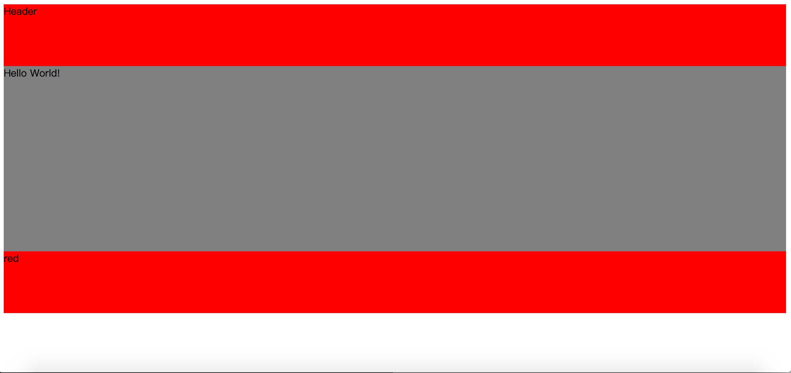

# 最简单的组件化工程

首先初始化一个项目，命名为v0.0.1，目录结构如下：

```
vue-section-1-1
  │  index.html
  │  vue.js
  └─components
      ├─Content.js
      ├─Footer.js
      └─Header.js
```
vue.js是vue完整版库文件，来源于 https://unpkg.com/vue ，为了更快的开发体验，于是将其下载到项目中。

components里面存放项目的各个组件，按照[官方](https://cn.vuejs.org/v2/guide/components.html#注册)提供的定义全局组件的方法编写， Content.js Footer.js Header.js分别如下：
	
	//Content.js
	Vue.component('my-content', {
	  template: '<div>Content</div>'
	})
	
	//Header.js
	Vue.component('my-header', {
	  template: '<div>Header</div>'
	})
	
	//Footer.js
	Vue.component('my-footer', {
	  template: '<div>Footer</div>'
	})

index.html是项目的入口，代码如下：
	
	<!DOCTYPE html>
	<html>
	<head>
	  <meta charset="utf-8">
	  <title>my-project</title>
	</head>
	<body>
	  <script src="vue.js"></script>
	  <script src="components/Content.js"></script>
	  <script src="components/Header.js"></script>
	  <script src="components/Footer.js"></script>
	  <div id="app">
	    <my-header></my-header>
	    <my-content></my-content>
	    <my-footer></my-footer>
	  </div>
	  <script>
	    new Vue({
	      el: "#app"
	    })
	  </script>
	</body>
	</html>
	
这是一个非常简单的项目构建形式，我们思考下这样构建的优劣：

优势：

1. 不需要额外引入webpack等打包工具，使用\<script\>标签引入即可，上手简单

劣势：

1. 组件中的html使用字符串的形式返回，编写过程难以借助IDE，容易出错
2. 一个组件往往由多个组件组成，这样的形式不容易做出嵌套组件
3. 组件需要通过\<script\>标签引入，每次编写都要手动引入使得代码变得臃肿
4. 使用\<script\>引入的顺序由限制，子组件引入的时候必须放在父组件前
5. 单个组件难以含有完整的JS逻辑，CSS样式和HTML节点，使得制作共享组件变得复杂


## 项目地址：

[https://github.com/zcmyworld/vue-builder-source-code](https://github.com/zcmyworld/vue-builder-source-code)

## 启动：

 * cd v0.0.1 
 * http-server （http-server是一个非常轻量的web容器，详情[了解这里](https://github.com/indexzero/http-server)
 * 访问 127.0.0.1:8080

按照上面的设计，劣势是非常明显的。

或者我们可以思考下，怎样的形式，才是舒服的形式。

以[sweetalert](https://github.com/t4t5/sweetalert)为例（学习vue并不需要了解sweetalert是什么，这只是个例子）。要使用这个组件，只需要引入对应的JS和CSS。在使用的时候，他会使用JS去生成对应的HTML代码，然后用CSS去渲染。这对使用者来说是非常友好的事情，但是，对于开发者并不友好。

我们希望，组件内所有的JS, CSS, HTML代码，并且代码只需经过少量修改，就能被浏览器所执行，（使用JS生成HTML代码实在是不友好的方式）。

继续改进项目v0.0.1，修改版本号为v0.0.2。

修改components中的 Header.js 并将后缀重命名为 .html 改造成：

	<div>Content</div>
	
	<script>
		//用于编写组件中的逻辑
	</script>
	
	<style>
		/*用于编写组件的样式*/
	</style>

另外的Content.js和Footer.js也做出类似的修改，不再累述。

那接下来的问题是，怎样将这些组件组建成一个页面？Vue自身提供了一套解决方案，但这里并不打算过早地探讨Vue的实现方案。按照过往的做法，我们可以使用模板引擎去完成组件组建。

v0.0.2使用Node.js作为后端语言，使用Express作为开发框架，使用ejs作为模板引擎。代码非常简单且配有详细注释，没有Node相关基础应该也很容易明白。

项目地址：

目录结构更改为：

```
vue-section-1-1
  ├─components
  │   ├─Content.html
  │   ├─Footer.html
  │   ├─Header.html
  │   └─index.html
  ├─src
  │   ├─app.js
  │   ├─package.json
  │   └─node_modules
  └─statics
      └─vue.js
```
目录结构主要的调整包括有：

1. 将index.html移动到components目录下（因为模板文件一般都在同一目录下，所以将index.html的位置进行更改
2. 创建src目录，主要用于存放后端代码
3. 创建statics，用于存放vue.js这一类静态文件

App.js 源代码如下：

	var express = require('express');
	var app = express();
	var path = require('path')
	
	//设置模板文件所在目录
	app.set('views', path.join(__dirname, '../components'));
	
	//设置使用ejs模板引擎
	app.engine('.html', require('ejs').__express);
	
	//设置模板引擎文件后缀为.html
	app.set('view engine', 'html');
	
	//设置静态文件访问路径
	app.use(express.static(path.join(__dirname, '../statics')));
	
	// 使用 ／ 路由访问到 index.html 资源
	app.get('/', function (req, res) {
	  res.render('index.html');
	});
	
	//监听 8080 端口
	app.listen(8080);
	
阅读注释大概可以知道代码作用，不做详述。

接下来希望能实现几个功能：

1. 各个组件在 index.html 中组建
2. 父组件可以向子组件传递参数从而影响子组件的行为
3. 组件内完成CSS, JS, HTML的编写

修改 header 组件，使其成为一个有固定长宽的 DIV

	<div id="Header">Header</div>
	
	<script></script>
	
	<style>
	  #Header {
	    background-color: red;
	    width: 100%;
	    height: 100px;
	  }
	</style>
	
修改 content 组件，使其拥有固定样式，且使用Vue呈现数据

	<div id="Content">{{message}}</div>
	
	<script>
	   new Vue({
	    el: '#Content',
	    data: {
	      message: 'Hello World!'
	    }
	  })
	</script>
	
	<style>
	  #Content {
	    width: 100%;
	    height: 300px;
	    background-color: gray;
	  }
	</style>
	
修改 footer 组件，使其拥有固定样式，并从父组件读取变量，改变自身的颜色

	<div id="Footer">
	  <%=bgc%>
	</div>
	
	<script></script>
	
	<style>
	  #Footer {
	    width: 100%;
	    height: 100px;
	    background-color: <%=bgc%> 
	  }
	</style>
		
在 index.html 使用 ejs 提供的 include 方法组合各个组件

	<!DOCTYPE html>
	<html>
	<head>
	  <meta charset="utf-8">
	  <title>my-project</title>
	  <style>
	  </style>
	</head>
	<body>
	  <script src="vue.js"></script>
	  <%- include('Header.html') %>
	  <%- include('Content.html') %>
	  <%- include('Footer.html', {bgc: 'red'}) %>
	</body>
	</html>

最总结果显示如下：



这种设计的优点缺点也非常明显：

优点： 

1. 实现了UI组件化


缺点：

1. 依赖于后端模板引擎的实现（这是否算是缺点存疑，PHP框架 Laravel 提供的 blade 模板引擎十分强大，ejs 一般
2. 组件内的css，js作用域没有进行控制，可能会影响到其他组件
3. 如果想做单页面应用，组件切换需要后端重新渲染，很难做到平滑过渡


## 项目地址：

[https://github.com/zcmyworld/vue-builder-source-code](https://github.com/zcmyworld/vue-builder-source-code)

## 启动：

 * cd v0.0.2/src
 * npm install 
 * node app.js
 * 访问 127.0.0.1:8080


## 总结

以上两种都是实现组件化的其中一种方式，第一种方式在实际开发中几乎不会用到。第二种方法也是比较常用的一种方法，也是PHP 框架 Laravel 官方推荐的一种方式。但是利用后端渲染的硬伤是很难做到组件平滑过渡。接下来过介绍 Vue 实现组件化的解决方案。